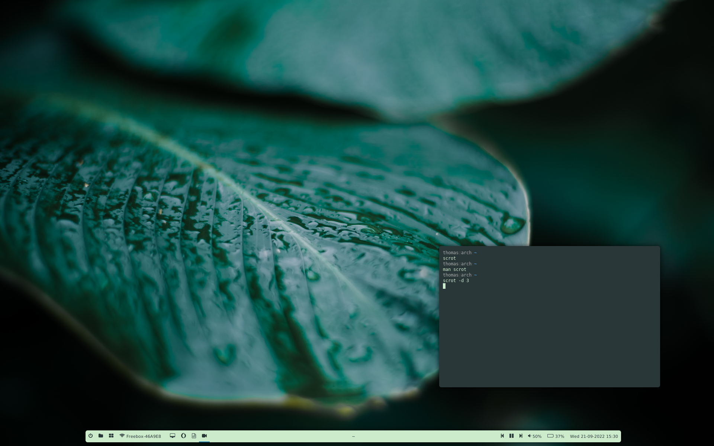

## Requirements
You first have to install a bunch of packages in order to make it work.

> If you're running low hardware you should not use picom. Be sure to remove corresponding entry into `i3/config`

- `stow` in order to deploy the dotfiles
- `vim-plug`
- `i3-gaps`
- [i3lock-fancy-rapid](https://github.com/peltho/i3lock-fancy-rapid)
- `termite`
- [polybar](https://github.com/polybar/polybar)
- `feh`
- `pywal` for generating colors based on your wallpaper
- [picom](https://github.com/peltho/picom) for transparency/shadows with round corners
- `awesome-terminal-fonts` for polybar icons

### Installation
For `i3lock-fancy` you'll have to compile it from sources by cloning the repo then use `make` command.
After that you might have to put the generated file to `/usr/bin/` names as `i3lock-fancy`.

> [Some extra info for polybar if you compile from sources](https://github.com/polybar/polybar/wiki/Compiling)

After that, deploy the dotfiles in your system this way: `sh install.sh`.

## Preview

